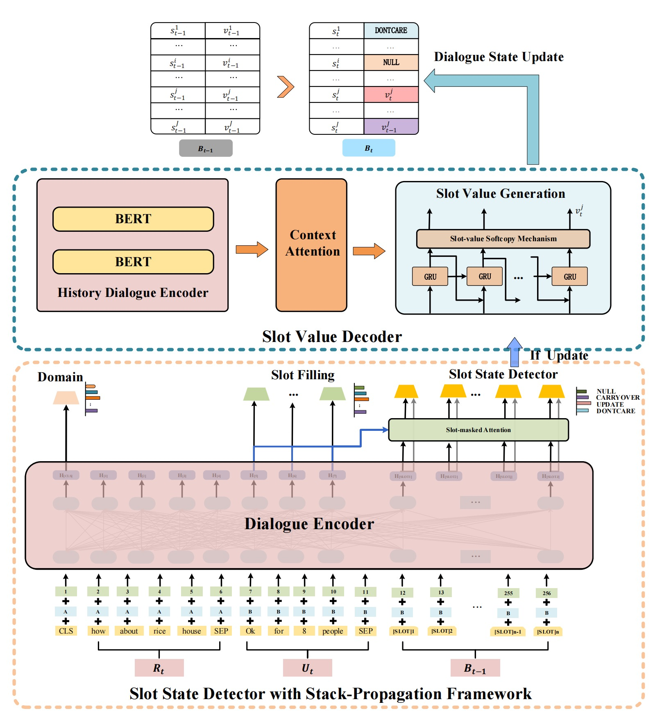

# SPSF-DST


This code is the pytorch implementation of [A Stack-propagation Framework with Slot Filling for Multi-domain Dialogue State Tracking].<br>
> Yufan Wang，Jie Mei


<p align="left"></p>

## Slot filling and DST
<p align="left"></p>

## Stack-propagation framework
<p align="left"></p>


## Requirements

```
python3.6
pytorch-transformers==1.0.0
torch==1.3.0
wget==3.2
```

## Data
```
Dataset: MultiWOZ dataset
Data preprocessing: data/mwz1.0/XXX_relabel.jason
```


## Model Training
To train the SPSF-DST model, please run this script. <br>
`$DATASET_DIR` is the root directory of the preprocessed dataset, and `$SAVE_DIR` is output directory that best_model's checkpoint will be saved. <br>
This script contains the downloading process of pretrained-BERT checkpoint depending on `--bert_ckpt_path`. `--bert_ckpt_path` should contain either `base` or `large`. 
```

Algorithm: Training a SPSF-DST model.
Initialize model parameters Θ.
First stage: Train the Dialogue Encoder parameters.
Set the max number of epochs: epoch_max
for epoch in 1, 2, ..., epoch_max do
 for b_t in D do      //b_t is a mini-batch, D is dataset.
   1.Compute loss: L_(domain,t)，L_(slot-filling,t)，L_(slot-state,t)
                   L_(domain,t) (Θ)  = Eq. 31         for domain classification
                   L_(slot-filling,t) (Θ) = Eq. 32    for slot filling
                   L_(slot-state,t) (Θ) = Eq. 33      for slot state detector
                   L_stage1=L_(domain,t)+L_(slot-filling,t)+L_(slot-state,t)

   2. Compute gradient: ∇(Θ)
   3. Update model: Θ = Θ − ϵ∇(Θ)
 end
end
Save parameters Θ^'=Θ
Second stage: Train the SPSF-DST model parameters.
for epoch in 1, 2, ..., 〖epoch〗_max do
 for b_t in D do
    1.Compute loss: L
                 L_stage2(Θ') = Eq. 35                 for SPSF-DST model
    2. Compute gradient: ∇(Θ')
    3. Update model: Θ' = Θ' − ϵ∇(Θ')
 end
end

```

## Model Evaluation

If you want to evaluate the already trained model, you can run this script. <br>
`$MODEL_PATH` is the checkpoint of the model used for evaluation, and `$DATASET_DIR` is the root directory of the preprocessed dataset. <br>
You can download the pretrained SPSF-DST model from [model_bset.bin].

```
python3 evaluation.py 
```

### Sample output of evaluation

```
------------------------------
op_code: 4, is_gt_op: False, is_gt_p_state: False, is_gt_gen: False
Epoch 29 joint accuracy :  0.5496742671009772
Epoch 29 slot turn accuracy :  0.9744933043792557
Epoch 29 slot turn F1:  0.9119078410951678
Epoch 29 op accuracy :  0.9754433586680724
Epoch 29 op hit count :  {'delete': 20, 'update': 6912, 'dontcare': 9, 'carryover': 208671}
Epoch 29 op all count :  {'delete': 1273, 'update': 9970, 'dontcare': 410, 'carryover': 209387}
Latency Per Prediction : 35.321136 ms
-----------------------------

```

Main results on MultiWOZ dataset (Joint Goal Accuracy)


|Model        |MultiWOZ 2.0 |MultWOZ 2.1|
|-------------|------------|------------|
|SOM-DST Base | 54.96      | 54.50      |


```

### Acknowledge
Thanks for authors of the paper Efficient Dialogue State Tracking by Selectively Overwriting Memory.
> [Sungdong Kim](https://github.com/dsksd), [Sohee Yang](https://github.com/soheeyang), [Gyuwan Kim](mailto:gyuwan.kim@navercorp.com), [Sang-woo Lee](https://scholar.google.co.kr/citations?user=TMTTMuQAAAAJ)<br>
> In ACL 2020.

